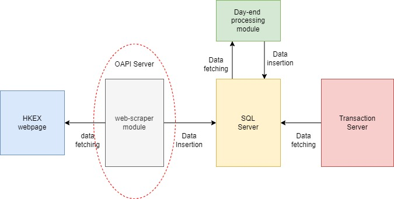
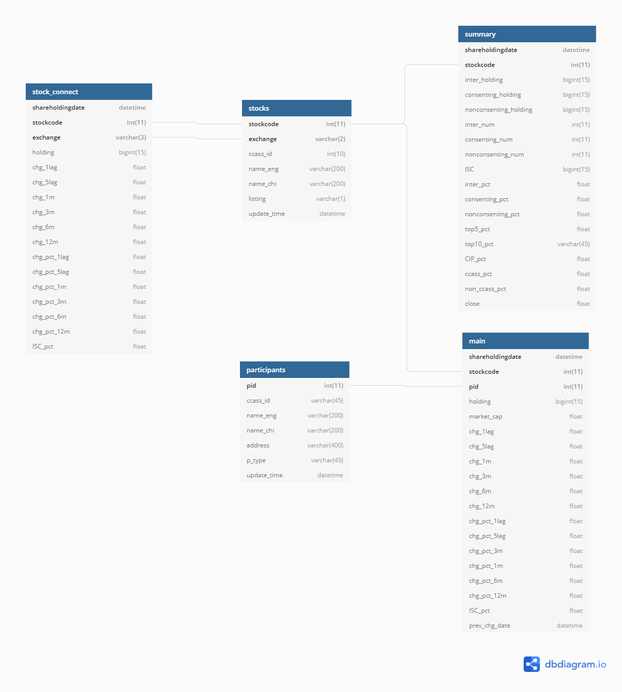
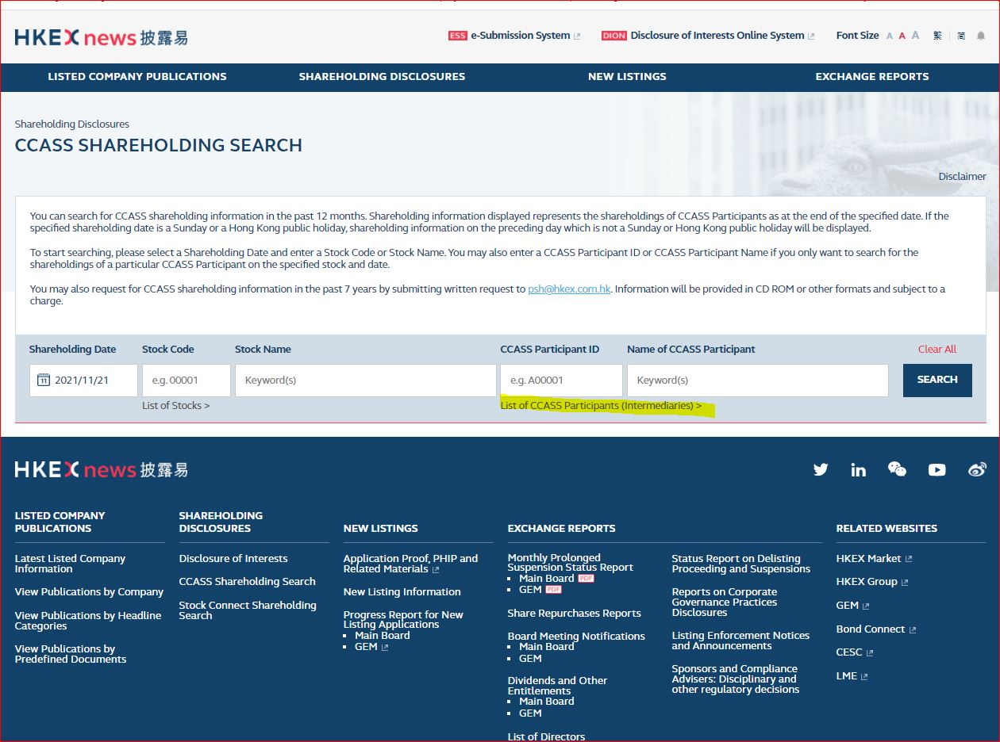
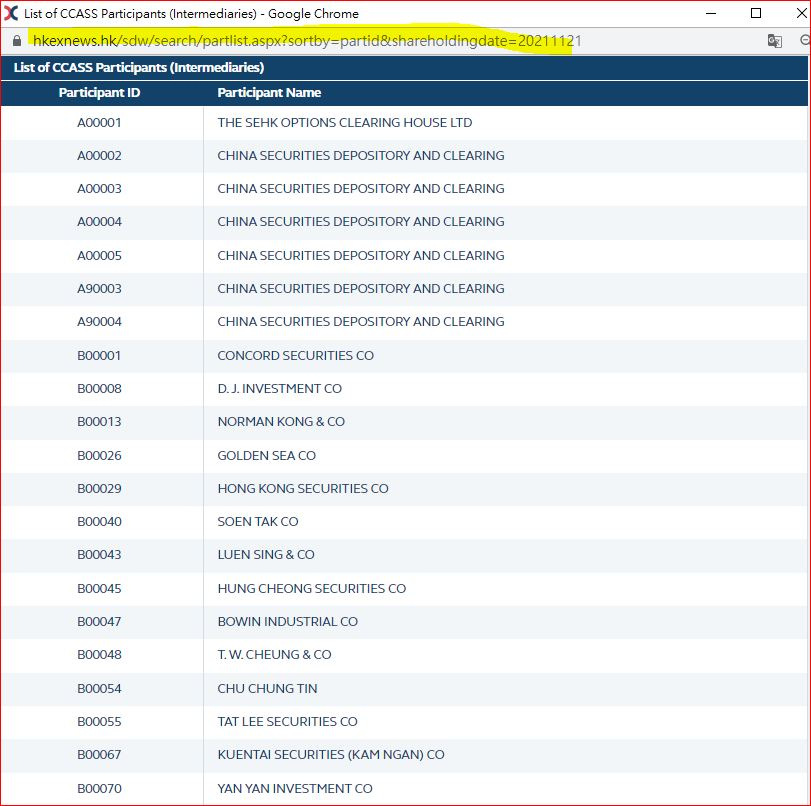
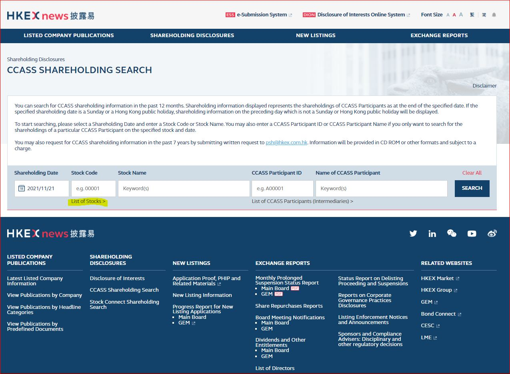
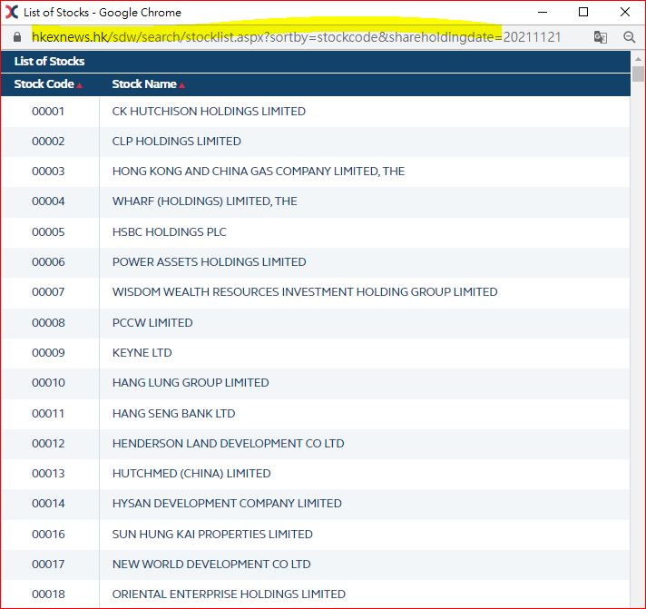
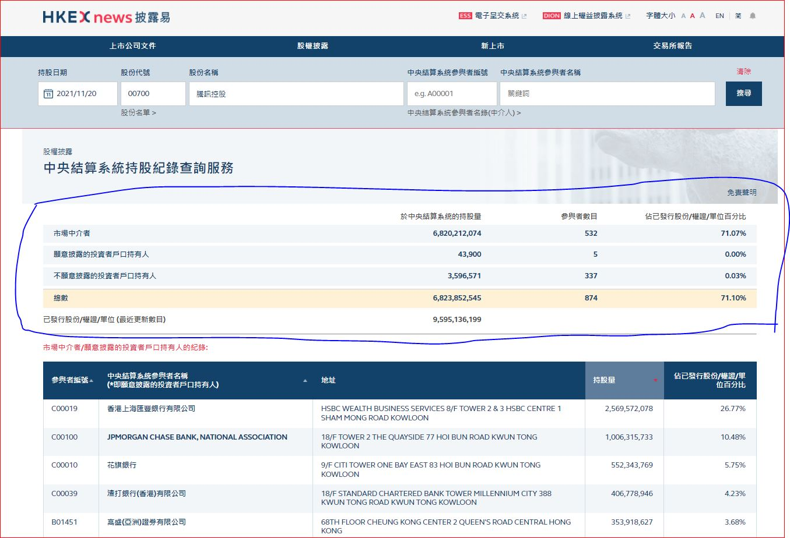
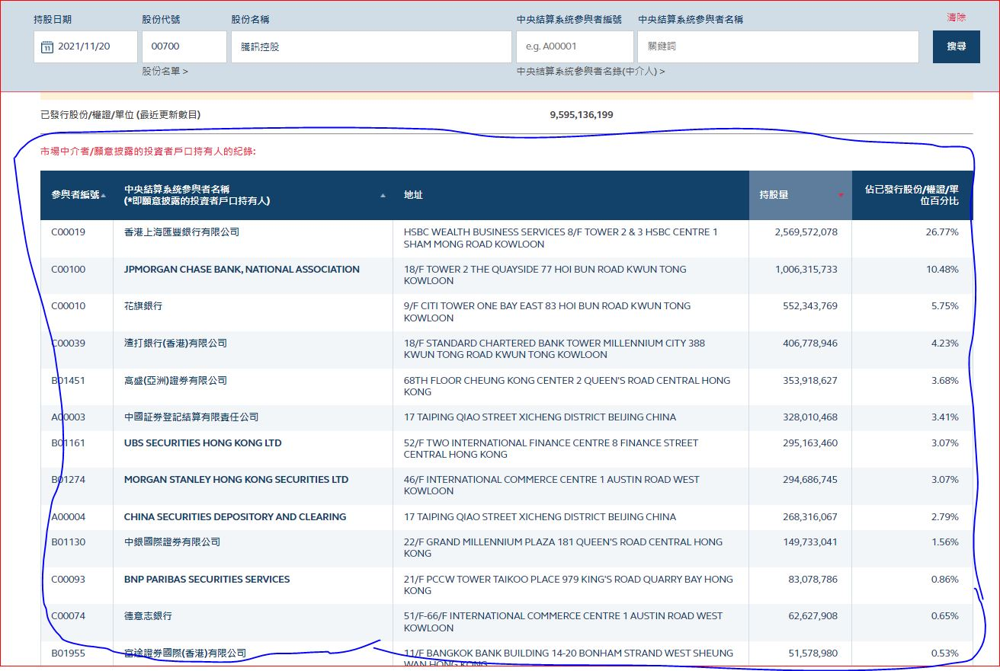

# Introduction
#### This project aims to  provide a web-scraping robot to extract and download the CCASS information from HKEX webpage . 
#### CCASS for HK stocks:  https://www.hkexnews.hk/sdw/search/searchsdw.aspx
#### CCASS for stock-connect scheme:  https://www2.hkexnews.hk/Shareholding-Disclosures/Stock-Connect-Shareholding?sc_lang=en

# CCASS project structure

The CCASS product has four components: (overall workflow is shown as below graph): 
1. web-scrapper module : scrap data from HKEX CCASS pages and insert data to SQL database
2. SQL DB server (schema name: CCASS) : store CCASS data generated from web-scrapper and data from dayend processing scripts
3. Dayend processing module: calculate the processed data after the raw data is scrapped from HKEX webpages and then insert calculated results into SQL DB schema
4. transactional server : produce APIs output and act as between

# CCASS workflow

# CCASS web-scraper module
The web-scraping module is one of the four components of CCASS project. It was built by python3.7.9 with web-scrapping application (e.g. requests, multi-thread) and is targeted to fetch CCASS data for about ~2800 listco on daily basis in Tue-Sat for each week. 

Inputs : URLs of HKEX ccass webpage and parameters of URLs, e.g. shareholdingdate, stockcode, back_day, etc.
Outputs: CCASS raw data from HKEX ccass webpage and stored in "CCASS" schema in SQL database

The web-scrapper module contains four core elements
1. config module: contains yaml file storing all key parameters and urls and Config.py script to convert data in yaml file into reusable python variable
2. database module: contains SQL insert query and database connection in python format
3. execution scripts:
- stockcode.py
- participant.py
- summary_main.py 
4. tool.py: contain supplementary functions for data processing, e.g. datetime conversion,

## Module flow-chart

## Purpose

