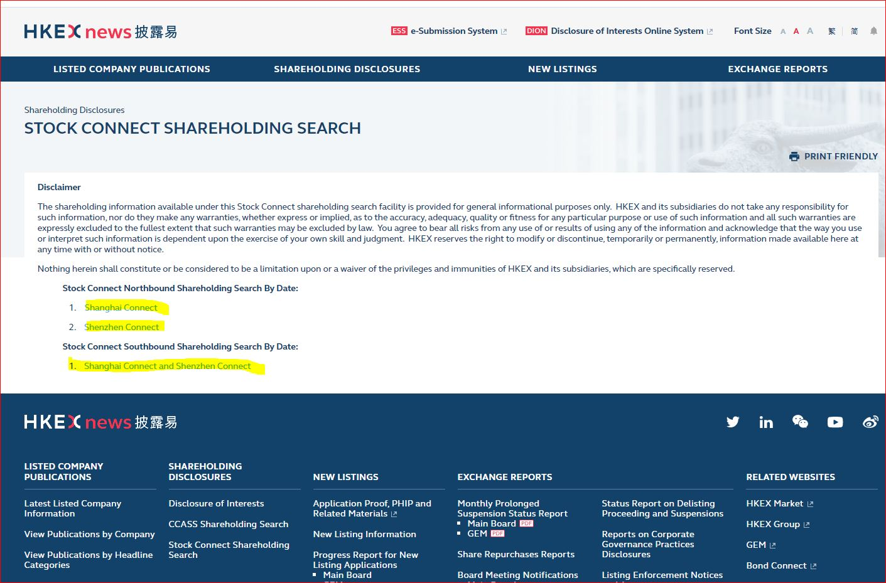
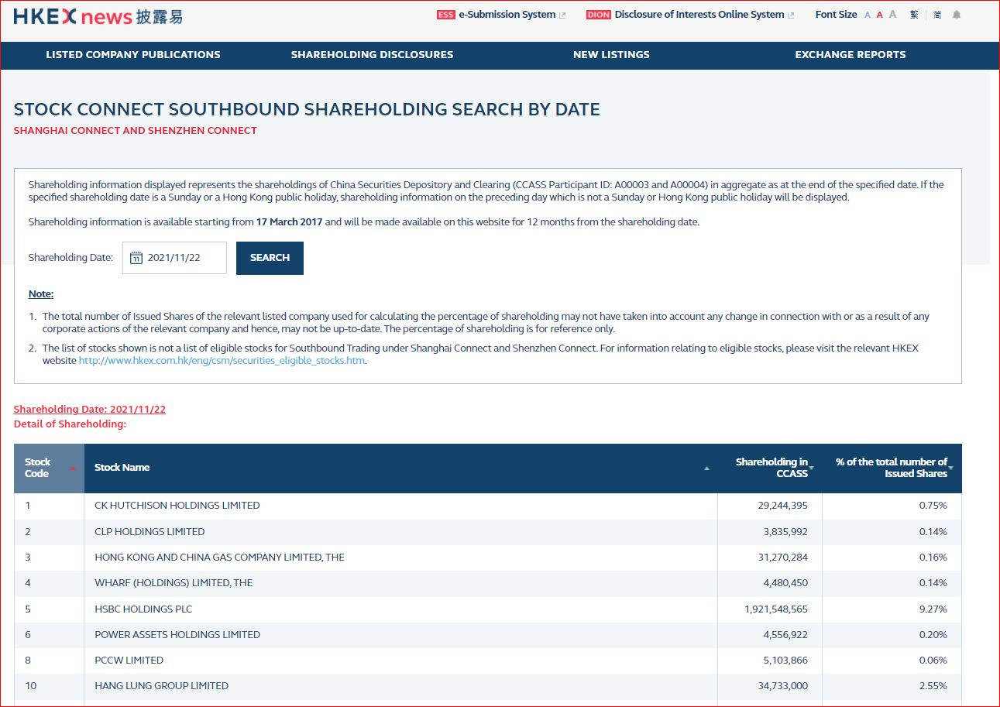
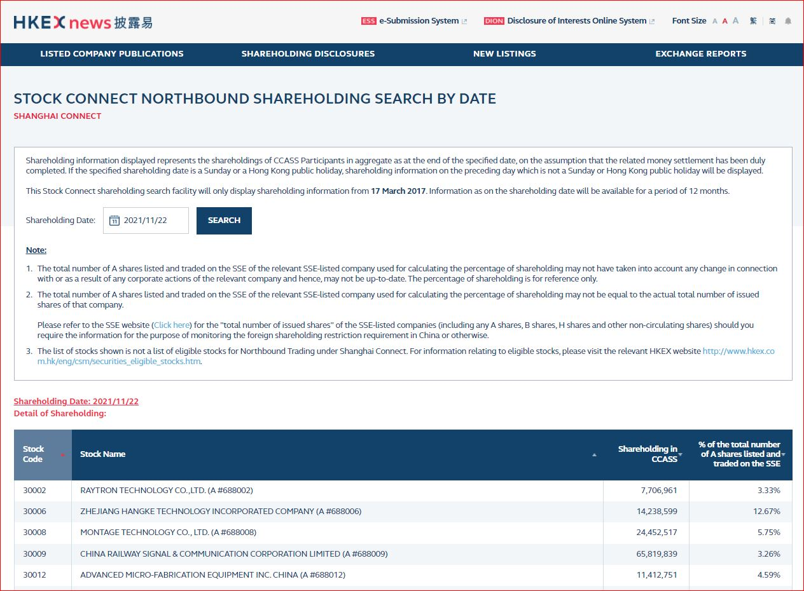
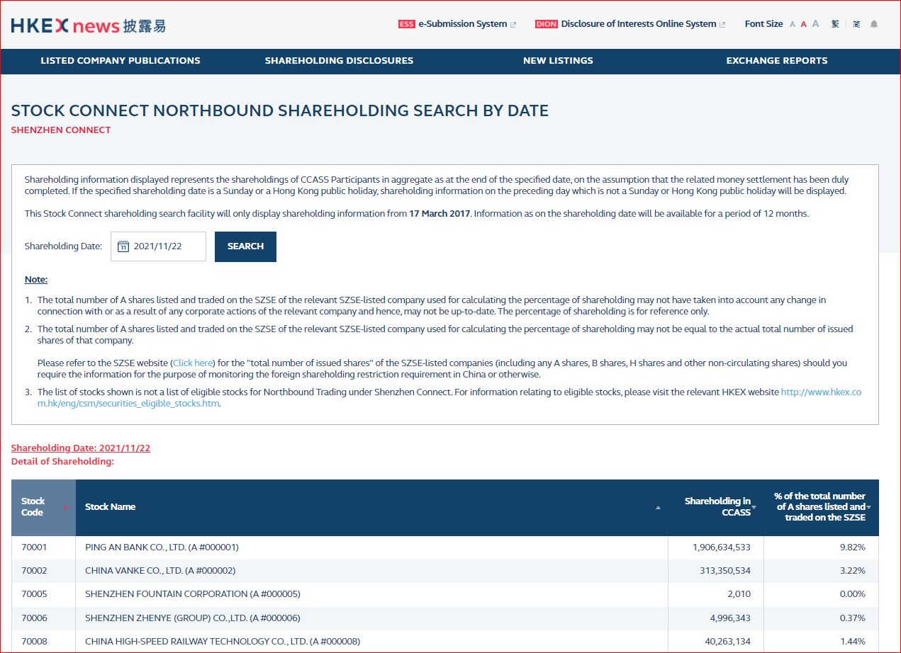

# Introduction
#### This project aims to  provide a web-scraping robot to extract and download the CCASS information from HKEX webpage . 
#### CCASS for HK stocks:  https://www.hkexnews.hk/sdw/search/searchsdw.aspx
#### CCASS for stock-connect scheme:  https://www2.hkexnews.hk/Shareholding-Disclosures/Stock-Connect-Shareholding?sc_lang=en

# CCASS project structure

The CCASS product has four components: (overall workflow is shown as below graph): 
1. web-scrapper module : scrap data from HKEX CCASS pages and insert data to SQL database
2. SQL DB server (schema name: CCASS) : store CCASS data generated from web-scrapper and data from dayend processing scripts
3. Dayend processing module: calculate the processed data after the raw data is scrapped from HKEX webpages and then insert calculated results into SQL DB schema
4. transactional server : produce APIs output and act as between

# CCASS workflow

# CCASS web-scraper module
The web-scraping module is one of the four components of CCASS project. It was built by python3.7.9 with web-scrapping application (e.g. requests, multi-thread) and is targeted to fetch CCASS data for about ~2800 listco on daily basis in Tue-Sat for each week. 

Inputs : URLs of HKEX ccass webpage and parameters of URLs, e.g. shareholdingdate, stockcode, back_day, etc.
Outputs: CCASS raw data from HKEX ccass webpage and stored in "CCASS" schema in SQL database

The web-scrapper module contains four core elements
1. config module: contains yaml file storing all key parameters and urls and Config.py script to convert data in yaml file into reusable python variable
2. database module: contains SQL insert query and database connection in python format
3. execution scripts:
- stockcodes.py : scrap data from url : https://www.hkexnews.hk/sdw/search/stocklist.aspx?sortby=stockcode&shareholdingdate={shareholdingdate}
- participants.py: scrap data from url : https://www.hkexnews.hk/sdw/search/partlist.aspx?sortby=partid&shareholdingdate={shareholdingdate}
- stock_connect.py : scrap data from url : https://www2.hkexnews.hk/Shareholding-Disclosures/Stock-Connect-Shareholding?sc_lang=en
- summary_main.py :scrap data from url : https://www.hkexnews.hk/sdw/search/searchsdw.aspx
4. tool.py: contain supplementary functions for data processing, e.g. datetime conversion,

# SQL database structure
The CCASS raw data is stored at the "CCASS" schema in SQL server. There are five tables in the CCASS schema and each of them is responsible to store one category of CCASS dat. T
- stocks table:  https://www.hkexnews.hk/sdw/search/stocklist.aspx?sortby=stockcode&shareholdingdate={shareholdingdate}
- participants table: https://www.hkexnews.hk/sdw/search/partlist.aspx?sortby=partid&shareholdingdate={shareholdingdate}
- stock_connect : https://www2.hkexnews.hk/Shareholding-Disclosures/Stock-Connect-Shareholding?sc_lang=en
- summary: The upper table in https://www.hkexnews.hk/sdw/search/searchsdw.aspx
- main: The lower table in https://www.hkexnews.hk/sdw/search/searchsdw.aspx

# ER diagram of CCASS schema

# **Detail instructions of execution scripts**

### Server IP addresses
- UAT: 10.200.23.218
- Production:  Kodak : 10.200.23.218 ,  TKO: 10.200.17.237

### folder  directory 
- /opt/etnet/ccass_production 
    

# Participants.py
### manual execution command: 
- python3 participants.py --help
- python3 participants.py --shareholdingdate '<YYYY-MM-DD>'

- hkex CCASS participant url : https://www.hkexnews.hk/sdw/search/partlist.aspx?sortby=partid&shareholdingdate={YYYYMMDD} 

### Details of participants data
There are two types of participants, intermediaries (券商 or 中介人) and investp (individual/persons).    The participants URL from HKEX and participant.py script can only fetch data of "intermediaries". For CCASS data of investp, the data will be fetched and updated by the script of "summary_main.py" script.
    
For intermediaries, the participants URL will provide ~1300 participants data. All intermediaries participants have unqiue address and participant_id (~equivalent to ccass_id in "participants table" in SQL DB) from HKEX CCASS webpage.
    
Intermediaries participants with participant ID of A00003 and A00004 represent the accounts of HK-China stock-connect (Shanghai) and HK-China stock-connect (Shenzhen), respectively.
    
## Entry of participant data in HKEX webpage

## Intermediaries webpage

-------------------------------------------------------------------------------------------------------------------------------------------------

# stockcodes.py
### manual execution command: 
- python3 stockcodes.py --help
- python3 stockcodes.py --shareholdingdate '<YYYY-MM-DD>'

- hkex CCASS stockcodes url : https://www.hkexnews.hk/sdw/search/stocklist.aspx?sortby=stockcode&shareholdingdate={YYYYMMDD}

### Details of stockcodes data
The stockcodes in URL contain ~2820 HK stockcodes, ~1400 SH stockcodes and ~950 SZ stockcodes, respectively. The stockcodes of SH and SZ are all qualified within the HK-China stock-connect scheme.
    
HK stocks with delisted status or share suspended will be labelled "N" at listing column of stocks table, while others stocks will be labelled "Y" at listing column.
    
Primary keys in stocks table in SQL DB are stockcode and exchange (e.g. HK,SZ or SH). The ccass_ids in stockcode table in SQL DB are the data in the "Stock Code" columns of the stockcode url. For all HK stocks, their ccass_ids are equal to stockcodes but for SH and SZ stocks, ccass_ids  deviate from stockcodes given that HKEX use another unique identifiers (the data in "Stock Code" columns) in the CCASS stockcode url.

## Entry of stockcodes data in HKEX webpage

## stockcodes webpage

-------------------------------------------------------------------------------------------------------------------------------------------------
# stock_connect.py
### manual execution command: 
- python3 stock_connect.py --help
- python3 stock_connect.py --shareholdingdate '<YYYY-MM-DD>' 
    
### stock-connect urls: 
- entry : https://www2.hkexnews.hk/Shareholding-Disclosures/Stock-Connect-Shareholding?sc_lang=en    
- HK: https://www.hkexnews.hk/sdw/search/mutualmarket.aspx?t=hk
- SH: https://www.hkexnews.hk/sdw/search/mutualmarket.aspx?t=sh
- SZ: https://www.hkexnews.hk/sdw/search/mutualmarket.aspx?t=sz
    
## Entry of stock-connect data in HKEX webpage

## Stock-connect HK webpage

## Stock-connect SH webpage

    
## Stock-connect SZ webpage

 
-------------------------------------------------------------------------------------------------------------------------------------------------
# summary_main.py
### manual execution command: 
- python3 summary_main.py --help
- python3 summary_main.py --shareholdingdate '<YYYY-MM-DD>' 

### summary_main url :  https://www.hkexnews.hk/sdw/search/searchsdw.aspx
    
### Detail of summary_main.py 
The data of summary table and main table in SQL DB are scraped by the same python script - summary_main.py . 
    
The data in url represents CCASS holding of each stock with breakdown by participants. 
    
The summary table in SQL DB stores data of the upper table of the URL (shown below) and the data in lower table is stored in main table of SQL DB.

There are about ~2800 records in summary table for each shareholdingdate. The total numbers of records in summary table is equivalent to the total numbers of stocks trading at the shareholdingdate (excl. delisted and suspended stocks)
    
There are about ~470k of total records in main table for each shareholdingdates
  
## Upper table of Summary    

## Lower table of Main

